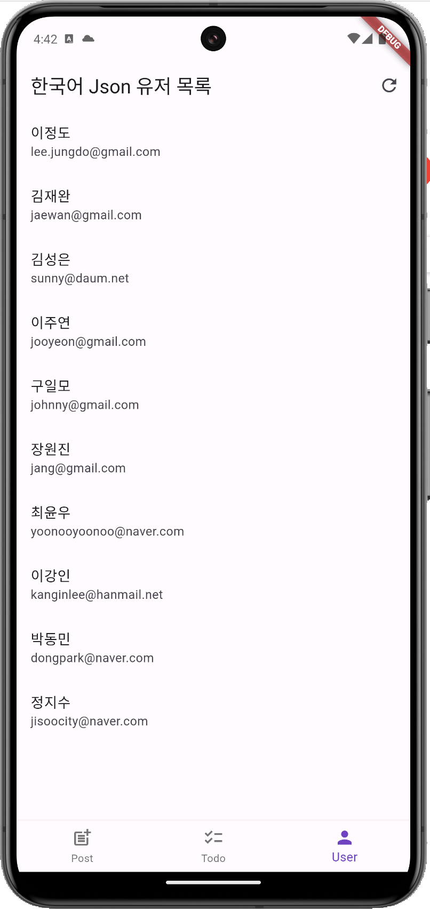

# 한국말 JSON API를 사용한 Flutter 앱

> GDSC DEU 23-24 Flutter 스터디 4주차 실습 코드

## 사용한 API

- [Korean JSON](https://koreanjson.com/)

## 사용한 패키지

- [http](https://pub.dev/packages/http) - HTTP 요청을 보내기 위한 패키지
- [intl](https://pub.dev/packages/intl) - 날짜 포맷을 변경하기 위한 패키지

## 스크린샷

| Post                            | Todo                            | User                            |
| ------------------------------- | ------------------------------- | ------------------------------- |
|  |  |  |
